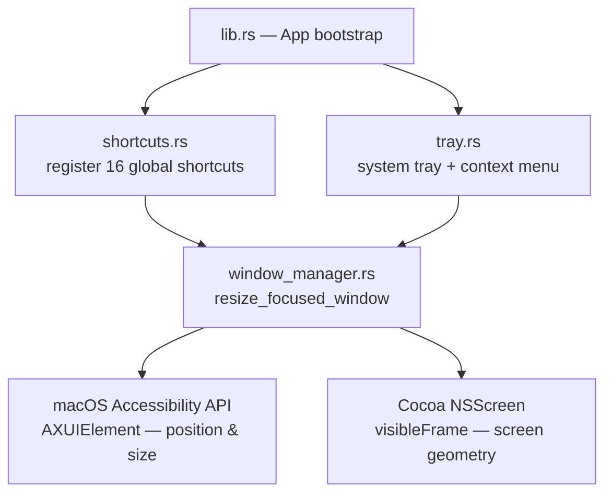

# Matrix-Dust

> Precision window management for macOS — lightweight as dust, powerful as a matrix.

Matrix-Dust is a tray-only macOS utility that snaps any window into a structured grid layout via global keyboard shortcuts. It runs silently in the background with zero Dock presence, and requires no mouse interaction once you know the keys.

---

## Motivation

macOS ships with no built-in tiling window manager. Third-party alternatives (Magnet, Rectangle, Moom) are either paid, bloated, or require too much configuration. Matrix-Dust started as the window-adjustment module inside a larger [screen-craft](../../) project and was extracted into its own standalone app because:

- **It should do one thing well** — snap windows, nothing else.
- **It should be invisible** — no Dock icon, no splash screen, no update nags.
- **It should be fast** — shortcuts must feel instantaneous; no scripting bridge in the way.
- **It should be hackable** — the source is small enough to read in an afternoon.

---

## Architecture

Matrix-Dust is built on **Tauri v2**, which bundles a Rust backend with a minimal TypeScript frontend. The split of responsibilities is intentional:

```
matrix-dust/
├── src/                        # Frontend (TypeScript + Vite)
│   ├── main.ts                 # Shortcut reference UI — rendered only on demand
│   └── style.css               # Styles for the floating shortcut panel
├── src-tauri/
│   └── src/
│       ├── main.rs             # Binary entry point (calls lib::run)
│       ├── lib.rs              # App bootstrap, Tauri builder, activation policy
│       ├── window_manager.rs   # Core: AX API FFI + layout math + multi-monitor
│       ├── shortcuts.rs        # Global shortcut registration (16 bindings)
│       └── tray.rs             # System tray icon + context menu
├── Casks/
│   └── matrix-dust.rb         # Homebrew Cask definition for distribution
├── index.html                  # Shell HTML for the shortcut panel webview
├── package.json                # JS toolchain (Bun + Vite)
└── src-tauri/
    ├── Cargo.toml              # Rust dependencies
    └── tauri.conf.json         # Tauri / bundle configuration
```

### Module Relationship



### Key Design Decisions

| Decision                                     | Rationale                                                           |
| -------------------------------------------- | ------------------------------------------------------------------- |
| **Tauri v2** over Electron                   | ~10× smaller binary; native Rust backend; no bundled Chromium       |
| **AX API** over AppleScript                  | Direct C FFI — synchronous and ~100× faster than scripting          |
| **`NSApplicationActivationPolicyAccessory`** | Removes the app from the Dock and Cmd+Tab switcher entirely         |
| **Global shortcuts fire on key-release**     | Prevents accidental double-triggers when holding modifiers          |
| **Webview window hidden at startup**         | The UI is purely a shortcut reference card, not a primary interface |

---

## Implementation Details

### 1. Window Manager (`window_manager.rs`)

The entire window manipulation layer is gated behind `#[cfg(target_os = "macos")]` and calls the macOS **Accessibility (AX) API** directly through Rust FFI, with no scripting bridge:

```
AXUIElementCreateSystemWide()
  └─► CopyAttributeValue("AXFocusedUIElement")    ← get the focused element
        └─► CopyAttributeValue("AXWindow")         ← walk up to the window node
              ├─► CopyAttributeValue("AXPosition")  ← read current origin (CGPoint)
              ├─► CopyAttributeValue("AXSize")      ← read current size (CGSize)
              └─► SetAttributeValue("AXSize")  }
                  SetAttributeValue("AXPosition") } ← write new bounds (size first!)
```

> **Why size before position?** Some window servers clamp position based on the current size. Setting size first avoids off-by-one snapping artefacts.

#### Coordinate System Translation

macOS has two overlapping coordinate systems that must be reconciled:

- **AX API** — origin at top-left of the primary screen, Y grows **downward**.
- **Cocoa `NSScreen`** — origin at bottom-left of the primary screen, Y grows **upward**.

The conversion uses the primary screen height as the flip axis:

```rust
// Convert Cocoa visibleFrame (bottom-left origin) → AX coordinates (top-left origin)
let ax_visible_y =
    primary_height - (target_visible_frame.origin.y + target_visible_frame.size.height);
```

#### Multi-Monitor Support

The focused window's center point is computed in AX coordinates, then converted to Cocoa coordinates to iterate `NSScreen.screens` and find the containing screen. All layout math is then applied against that screen's `visibleFrame` — which excludes the menu bar and Dock area — ensuring snapped windows never overlap system chrome.

#### Layout Math

All 16 layouts are expressed as a single `match` over the `Layout` enum, computing `(x, y, width, height)` from the screen's visible rect `v`:

| Layout            | Formula                                   |
| ----------------- | ----------------------------------------- |
| Left Half         | `(v.x, v.y, v.w/2, v.h)`                  |
| Right Half        | `(v.x + v.w/2, v.y, v.w/2, v.h)`          |
| Top Half          | `(v.x, v.y, v.w, v.h/2)`                  |
| Bottom Half       | `(v.x, v.y + v.h/2, v.w, v.h/2)`          |
| Top-Left Quadrant | `(v.x, v.y, v.w/2, v.h/2)`                |
| Left Third        | `(v.x, v.y, v.w/3, v.h)`                  |
| Center Third      | `(v.x + v.w/3, v.y, v.w/3, v.h)`          |
| Right Third       | `(v.x + 2*v.w/3, v.y, v.w/3, v.h)`        |
| Left Two-Thirds   | `(v.x, v.y, 2*v.w/3, v.h)`                |
| Center Two-Thirds | `(v.x + v.w/6, v.y, 2*v.w/3, v.h)`        |
| Maximize          | `(v.x, v.y, v.w, v.h)`                    |
| Center            | keeps current size, re-centers within `v` |

### 2. Global Shortcuts (`shortcuts.rs`)

Shortcuts are registered via `tauri-plugin-global-shortcut` at app startup. Each binding fires on **key release** (`ShortcutState::Released`) to prevent duplicate triggers:

```rust
app.global_shortcut().on_shortcut("Ctrl+Alt+Left", move |_, _, event| {
    if event.state == ShortcutState::Released {
        resize_focused_window(Layout::Left);
    }
})?;
```

The modifier pair **Ctrl + Option** (`⌃ ⌥`) was chosen because it does not conflict with any default macOS system shortcut or common application shortcut.

### 3. System Tray (`tray.rs`)

The tray context menu is built programmatically via Tauri's `Menu` / `MenuItem` API. Every layout shortcut is represented as a menu item with its keyboard hint rendered natively by the system. Menu events dispatch to the exact same `resize_focused_window` function that keyboard shortcuts use — a single source of truth for layout logic.

Menu structure:

```
Left / Right / Top / Bottom          ← halves
──────────────────────────
Top Left / Top Right / …             ← quarters
──────────────────────────
Left Third / Center Third / …        ← thirds
──────────────────────────
Left ⅔ / Center ⅔ / Right ⅔         ← two-thirds
──────────────────────────
Maximize / Center
──────────────────────────
Shortcut Reference…                  ← opens the webview panel
Quit Matrix-Dust
```

### 4. App Bootstrap (`lib.rs`)

On startup the app performs the following steps in order:

1. **Hides from Dock and App Switcher** — calls `NSApp.setActivationPolicy(NSApplicationActivationPolicyAccessory)` (value `1`) via the `objc` crate.
2. **Registers global shortcuts** — calls `shortcuts::setup_shortcuts`.
3. **Creates the system tray** — calls `tray::create_tray`.
4. **Hides the main webview window** — the window exists but is invisible; it is only shown when the user clicks "Shortcut Reference…" in the tray menu.
5. **Intercepts `CloseRequested`** — re-routes the window close event to `window.hide()` so the app stays alive in the tray.

### 5. Shortcut Reference UI (`src/main.ts`)

A pure TypeScript module (no framework) that renders 16 layout cards into the webview. Each card displays:

- A miniature rectangle preview showing the zone the window will occupy.
- The layout name.
- The full shortcut combination.

The webview window is **decoration-less** and **transparent** (`decorations: false`, `transparent: true` in `tauri.conf.json`), giving it a floating panel appearance.

### 6. Distribution (`Casks/matrix-dust.rb`)

The app ships as a `.dmg` via GitHub Releases and is installable as a Homebrew Cask:

```bash
brew install --cask ZouYouShun/tap/matrix-dust
```

---

## Shortcuts

All shortcuts use **Ctrl + Option** (`⌃ ⌥`) as the modifier.

| Layout            | Shortcut | Description                        |
| ----------------- | -------- | ---------------------------------- |
| Left Half         | `⌃ ⌥ ←`  | Left 50% of screen                 |
| Right Half        | `⌃ ⌥ →`  | Right 50% of screen                |
| Top Half          | `⌃ ⌥ ↑`  | Top 50% of screen                  |
| Bottom Half       | `⌃ ⌥ ↓`  | Bottom 50% of screen               |
| Top Left          | `⌃ ⌥ U`  | Top-left quadrant                  |
| Top Right         | `⌃ ⌥ I`  | Top-right quadrant                 |
| Bottom Left       | `⌃ ⌥ J`  | Bottom-left quadrant               |
| Bottom Right      | `⌃ ⌥ K`  | Bottom-right quadrant              |
| Left Third        | `⌃ ⌥ D`  | Left ⅓ of screen                   |
| Center Third      | `⌃ ⌥ F`  | Middle ⅓ of screen                 |
| Right Third       | `⌃ ⌥ G`  | Right ⅓ of screen                  |
| Left Two-Thirds   | `⌃ ⌥ E`  | Left ⅔ of screen                   |
| Center Two-Thirds | `⌃ ⌥ R`  | Center ⅔ of screen                 |
| Right Two-Thirds  | `⌃ ⌥ T`  | Right ⅔ of screen                  |
| Maximize          | `⌃ ⌥ ↵`  | Fill the visible screen area       |
| Center            | `⌃ ⌥ C`  | Center window (keeps current size) |

---

## Installation

### Option 1 — Homebrew (recommended)

```bash
# Add the tap (one-time setup)
brew tap ZouYouShun/tap https://github.com/ZouYouShun/matrix-dust

# Install Matrix Dust
brew install --cask ZouYouShun/tap/matrix-dust
```

To update later:

```bash
brew upgrade --cask matrix-dust
```

To uninstall and remove all app data:

```bash
brew uninstall --cask matrix-dust --zap
```

### Option 2 — Manual

1. Download the latest `.dmg` from the [Releases](https://github.com/ZouYouShun/matrix-dust/releases/latest) page.
   - Apple Silicon → `Matrix.Dust_<version>_aarch64.dmg`
   - Intel → `Matrix.Dust_<version>_x64.dmg`
2. Open the `.dmg` and drag **Matrix Dust.app** into `/Applications`.
3. Launch the app — it will appear only in the menu bar, with no Dock icon.

> **First launch:** macOS will ask you to grant **Accessibility** permission.  
> Open **System Settings → Privacy & Security → Accessibility** and enable Matrix Dust.  
> Without this permission the app cannot read or move windows.

---

## Requirements

- **macOS only** — Intel (`x86_64`) and Apple Silicon (`aarch64`)
- **Accessibility permission** — grant in System Settings → Privacy & Security → Accessibility.
  The app cannot read or set window bounds without this permission.

---

## Development

```bash
# Install JS dependencies
bun install

# Start Tauri dev server
# Hot-reload applies to the TS/CSS frontend; Rust changes require a full rebuild.
bun run start     # alias for: tauri dev
```

> **Prerequisites:** Rust toolchain (`rustup` / `cargo`) and Xcode Command Line Tools.

## Build

```bash
bun run build:app           # default target (matches host machine)
bun run build:mac-silicon   # aarch64-apple-darwin only
bun run build:mac-intel     # x86_64-apple-darwin only
```

Output is placed in `src-tauri/target/<target>/release/bundle/`.

---

## Tech Stack

| Layer            | Technology                                                |
| ---------------- | --------------------------------------------------------- |
| Framework        | [Tauri v2](https://v2.tauri.app/)                         |
| Backend language | Rust 2021 edition                                         |
| Window control   | macOS Accessibility API (`ApplicationServices.framework`) |
| Screen geometry  | Cocoa `NSScreen` via `cocoa` + `objc` crates              |
| Global shortcuts | `tauri-plugin-global-shortcut v2`                         |
| Frontend         | TypeScript + Vite (no framework)                          |
| Package manager  | Bun                                                       |
| Distribution     | Homebrew Cask + GitHub Releases                           |

---

## License

MIT
